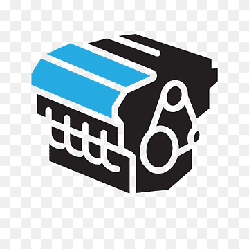
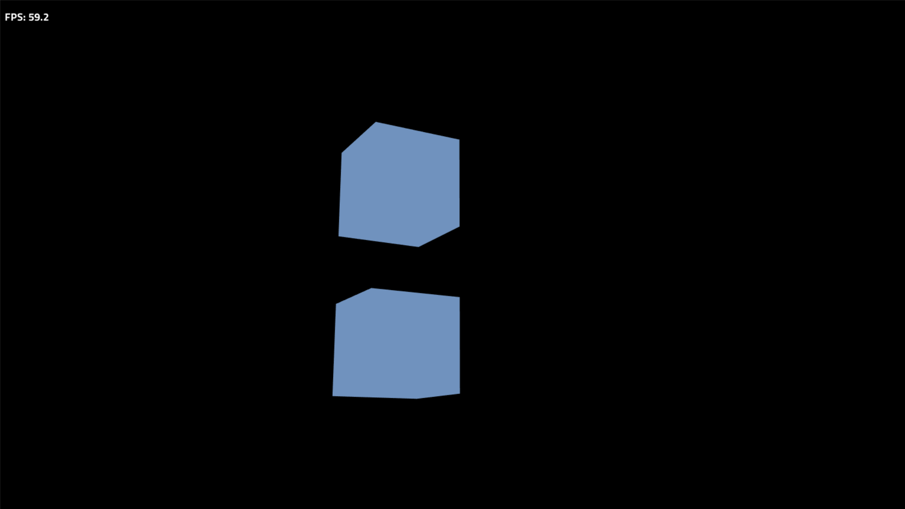

# 3D Game Engine Library



#### This is a simple 3D game engine built with Python, Pygame, and OpenGL. It provides a basic framework for creating 3D games and applications.
#### Exemple game builds on this engine: https://disk.yandex.ru/d/ONQAN8PDgMAMrA



## Table of Contents

1. [Features](#features)
2. [Installation](#installation)
3. [Structure](#structure)
4. [Main Components](#main-components)
5. [Usage](#usage)
6. [Example](#example)

## Features

- 3D rendering with OpenGL
- Camera system with collision detection
- Actor/GameObject system
- Mesh loading from JSON files
- Texture mapping support
- Basic collision detection
- Basic physical system
- Event handling system

## Installation

To use this 3D game engine, you need to have the following dependencies installed:

- Python 3.x
- Pygame
- NumPy
- PyOpenGL
- Pillow

You can install these dependencies using pip:

```
pip install pygame numpy PyOpenGL Pillow
```
Or
```
pip install -r requirements.txt
```

## Structure

The engine is organized into several modules:

- `core.py`: Contains the main `Engine` class that handles the game loop and OpenGL setup.
- `camera.py`: Implements the `Camera` class for 3D navigation.
- `actor.py`: Defines the `Actor` class for game objects.
- `mesh.py`: Contains the `Mesh` class for storing 3D model data.
- `methods.py`: Contains function `load_mesh_on_file` and `load_texture_on_file`.

## Main Components

### Engine

The `Engine` class is the core of the game engine. It handles:

- Initializing Pygame and OpenGL
- Managing the game loop
- Handling user input
- Updating and rendering game objects

### Camera

The `Camera` class manages the 3D view. It supports:

- Camera movement (WASD keys)
- Camera rotation (mouse input)

### Actor

The `Actor` class represents game objects in the 3D world. It:

- Stores position and mesh data
- Handles rendering of the object

### Mesh

The `Mesh` class stores the vertex and face data for 3D models.

## Usage

To use the engine, follow these steps:

1. Create an instance of the `Engine` class.
2. Load 3D models using `load_mesh_on_file`.
3. Create `Actor` instances with the loaded meshes.
4. Add the actors to the engine using `add_game_object`.
5. Call the `run` method on the engine to start the game loop.

## Example

Here's a simple example that loads and displays a cube and cylinder:

```python
import math

from pygame import Vector3

from engine3d import Engine, Actor, Camera, load_mesh_on_file, load_texture_on_file

player = Camera((0, 0, 12), collision=True)
game = Engine(player=player)

blue_texture = load_texture_on_file(file="engine3d/exemple_textures/blue_texture.png")
# Don't forget to look at engine3d/exemple_textures/test.png ))))

cube_mesh = load_mesh_on_file(file="engine3d/exemple_meshes/cube.json")
cylinder_mesh = load_mesh_on_file(file="engine3d/exemple_meshes/cylinder.json")

cube = Actor(position=(0, 0, 0), rotation=(0, 0, 0), mesh=cube_mesh, texture=blue_texture, collision=True)
game.add_game_object(cube)

physical_cube = Actor(position=(0, 7, 0), rotation=(0, 0, 0), mesh=cube_mesh, texture=blue_texture, collision=True, physic=True)
game.add_game_object(physical_cube)

radius = 6 # Distance from the cube
cylinder = Actor(position=(radius, 0, 0), rotation=(0, 0, 0), mesh=cylinder_mesh, texture=blue_texture, collision=True)
game.add_game_object(cylinder)
cylinder.apply_torque(Vector3(5, 5, 5))

angle = 0

def update():
    global angle
    angle += 0.02

    new_x = radius * math.cos(angle)
    new_z = radius * math.sin(angle)
    new_position = Vector3((new_x, 0, new_z))

    movement = new_position - cylinder.position
    cylinder.position = new_position

    camera_pos = Vector3(game.player.position)

    if cylinder.check_collision(camera_pos):
        push_direction = movement.normalize()
        game.player.position += push_direction * 0.1

game.add_update_function(func=update)
game.run()
```

This example initializes the engine, loads a cube mesh, creates an actor with the mesh, adds it to the engine, and starts the game loop.

Controls:
- Use W, A, S, D to move the camera
- Right-click and drag to rotate the camera
- Close the window to exit

With this engine, you can create simple 3D environments and games. Extend the `Actor` class to add more functionality to your game objects, or modify the `Engine` class to add more features to your game loop.